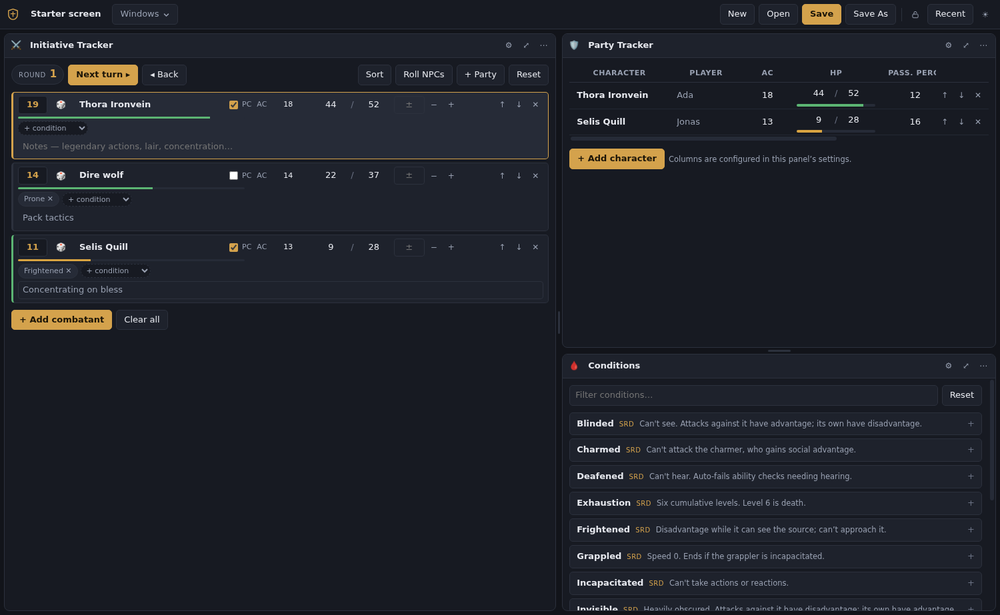

# Digital DM Screen

[](https://github.com/Travus/Digital_DM_Screen/actions/workflows/ci.yml)

A tiling DM screen for running tabletop games. Split the window into as many
panes as you want, drop a module into each one, and save the whole arrangement —
panel settings and contents included — as a layout file you can reopen or hand to
a friend.

Runs on Windows, Linux and Apple-silicon Macs. Built with Electron, React and
TypeScript. Windows and Linux builds use Docker; the Mac app is built on a
native Apple-silicon GitHub Actions runner, so nothing needs installing on the
host.



## Using it

**Tiling.** Every panel's `⋯` menu has *Split right* and *Split down*
(`Cmd/Ctrl+\` and `Cmd/Ctrl+Shift+\`). Splits nest freely, so the classic "one tall pane
on the left, two stacked on the right" is two splits. Drag the bar between panes
to resize; double-click it to even that row or column out. Closing a panel hands
its space back to its neighbours.

**Fullscreen.** The `⤢` button in any panel header blows it up to fill the
window; `Esc` or the floating button at the bottom brings the tiling back.
`Cmd/Ctrl+Enter` does the same from the keyboard.

**Locking.** Once a screen is arranged the way you want it, hit the padlock in
the top bar (or `Cmd/Ctrl+L`). Panes can no longer be resized, split or closed, and
the drag handles between them disappear so there is nothing to catch by
accident mid-session. Everything *inside* the panels carries on as normal —
including dragging party tracker columns. The lock is saved with the layout.

**Layouts.** *Save* writes a `.dmscreen` file containing the tree, every panel's
module, its settings and its live contents — your party roster, your notes, your
random tables. *Recent* in the top bar (also under **Layout → Open Recent**)
lists what you have opened before. Whatever is on screen is also stashed
automatically, so closing the app without saving costs nothing: it comes back
exactly as you left it.

Double-click a panel title to rename it; click the layout name in the top bar
(or press `F2`) to rename the layout.

There is a ready-made layout in [`examples/starter.dmscreen`](examples/starter.dmscreen)
— **Open** it to see a populated screen.

## Modules

| | Module | What it does |
|---|---|---|
| 🩸 | **Conditions** | Every status condition and its full effects, searchable. Conditions named inside another condition's text are hoverable — Paralyzed tells you what Incapacitated means without leaving the panel. |
| 📖 | **Rules Reference** | Actions, special attacks, cover, vision, DCs, travel, improvised damage, objects, resting. Choose which tabs a panel shows. |
| ✨ | **Player Abilities** | Metamagic and channel divinity, one tab each, labelled with where each option came from. Star the options your players actually took and they pin to the top. A [data pack](#data-packs) adds more tabs. |
| 🧫 | **Diseases** | The six a *contagion* can inflict, and the three with their own write-ups — saves, symptoms and cures. |
| 🛡️ | **Party Tracker** | Your party, with columns *you* define — number, text, checkbox, current/max meter, or **symbols**. Add, rename, reorder and retype columns in the panel's settings; drag the divider at the right edge of any header to resize a column, double-click it to reset. |
| ⚔️ | **Initiative Tracker** | Turn order, round counter, HP with damage/heal entry, conditions per combatant. *+ Party* pulls everyone straight out of a Party Tracker panel, and keeps their AC and HP in sync with it afterwards. Optionally hides enemy HP. |
| 📊 | **Counters & Tracks** | Resource counters (torches, rations, charges) and segmented progress tracks for things closing in. |
| ⏱️ | **Timers** | Count-up and count-down timers — session length, a player's turn, a burning fuse. Names are always editable; a countdown's duration can be changed whenever it isn't running. |
| 📝 | **Notes** | A scratchpad that travels with the layout. |
| 🎲 | **Dice Roller** | `2d6+3`, `4d6kh3`, `4d6dl1`, `250d20` — with a running history and configurable quick buttons. |
| 🗒️ | **Random Tables** | Your own roll tables, edited in place, one tab per table. |
| 🎭 | **Name Generator** | Names for people, taverns and shops. Flesh any of them out into a whole NPC (quirk + motive) or a whole place (detail + hook), and keep the ones you like. |

Panels with a `⚙` in the header have settings; those settings are saved with the
layout too.

### Initiative ↔ party sync

Combatants added with **+ Party** stay linked to the character they came from,
shown by a ⇄ on the row. Damage applied in initiative updates the party panel and
vice versa — there is one set of numbers, not two. The party panel opts in by
naming its columns exactly **AC** (number) and **HP** (meter); a column that
isn't there simply isn't synced. Turn it off per panel in the initiative
settings.

### Symbol columns

A **symbols** column holds one or more glyphs you pick per column, and each one
toggles between lit and dimmed per character — a checkbox that says what it is
about. Good for things a character either still has or has spent: a deity's
blessing, a one-shot luck reroll, an unused potion. Pick the glyphs from the
palette in the panel's settings, or paste any character you like. Repeating the
same glyph is fine — three ⭐ makes a three-charge tracker, and each toggles
independently.

## Data packs

The reference modules ship **SRD content only**, which is what lets the app be
licensed honestly. The SRD carries one archetype per class, so Player Abilities
has Metamagic and Channel Divinity and nothing else out of the box.

Anything more loads at runtime. **Data → Import Data Pack…** (`Cmd/Ctrl+I`) takes a
`.dmpack.json` holding conditions, rules, ability groups and diseases:

```json
{
  "formatVersion": 1,
  "id": "my-homebrew",
  "name": "My homebrew",
  "abilityGroups": [
    { "id": "maneuvers", "title": "Maneuvers", "blurb": "…", "entries": [ … ] }
  ]
}
```

Worth knowing:

- **Packs add; they never replace.** Entry ids are namespaced per pack, so two
  packs defining the same id both load. Use the switches to drop duplicates.
- **A group id that matches an existing tab extends it**, so adding one option
  doesn't mean restating the rest. A new id becomes a new tab — give it a title.
- **Data → Bundled SRD Content** and **Bundled Name Pools** switch off the built-in
  data. Load a superset pack, switch the SRD content off, and every card shows your
  own labels.
- **Packs are referenced by path, not copied.** Edit the file and choose *Reload
  Data Packs*. Move it and the app says so rather than going quiet — the sidebar
  carries a one-line summary of what is actually loaded.
- Condition **names** must be unique across everything loaded; they are what the
  cross-reference popovers scan for.

`examples/smoke-pack.dmpack.json` is a tiny working example.

## Keyboard

These are the defaults. **Help → Keyboard Shortcuts…** rebinds any of them:
click a shortcut, press the combination you want, and the menu and every button
caption follow it immediately. A combination needs Ctrl, Cmd, Alt or Super — a
bare key would fire while you were typing in a panel — and function keys are the
exception, which is why `F2` is a default.

| Key | Action |
|---|---|
| `Cmd/Ctrl+\` / `Cmd/Ctrl+Shift+\` | Split the active panel right / down |
| `Cmd/Ctrl+Enter` / `Esc` | Fullscreen the active panel / return |
| `Cmd/Ctrl+W` | Close the active panel |
| `Cmd/Ctrl+N` / `Cmd/Ctrl+O` / `Cmd/Ctrl+S` / `Cmd/Ctrl+Shift+S` | New / open / save / save as |
| `F2` | Rename the layout |
| `Cmd/Ctrl+L` | Lock or unlock the layout |
| `Cmd/Ctrl+I` | Import a data pack |

`Esc` is the one that cannot be changed: it leaves panel fullscreen, and it is
handled by the app itself rather than by the menu, because a menu shortcut for
`Esc` would swallow the key inside text fields too. Your changes live in
`keybindings.json` beside the layout session, so they survive a reinstall and
never travel inside a `.dmscreen` file.

## Building

Windows and Linux builds run through Docker Compose — no Node or Electron on the
host.

```sh
docker compose run --rm build npm install       # first time, and after dependency changes
docker compose run --rm build npm run dist:all  # Windows + Linux installers → ./release
```

`dist:all` produces, in `release/`:

- `Digital DM Screen-<version>-x64-setup.exe` — Windows installer
- `Digital DM Screen-<version>-x64-portable.exe` — Windows, no install
- `Digital DM Screen-<version>.AppImage` — Linux, no install
- `digital-dm-screen_<version>_amd64.deb` — Debian/Ubuntu

Use `dist:win` or `dist:linux` for one platform. Windows targets are cross-built
from Linux through Wine, which is why the compose service uses the
`electronuserland/builder:wine` image.

### macOS (Apple Silicon)

The Mac app is built on a native arm64 macOS runner. Do not add it to
`dist:all`: Linux can create an `.app` directory that looks plausible, but it
cannot create a trustworthy Mac bundle or disk image.

Pull requests that touch packaging inputs produce a
`macos-arm64-installer` Actions artifact. Tagged releases attach
`Digital DM Screen-<version>-arm64.dmg` alongside the Windows and Linux files.
Download the artifact, open the DMG, and drag the app to Applications.

The current personal build is ad-hoc signed because the project has no paid
Apple Developer ID. Gatekeeper therefore cannot verify a downloaded copy. After
copying it to Applications, clear quarantine once and open it:

```sh
xattr -dr com.apple.quarantine '/Applications/Digital DM Screen.app'
open -a 'Digital DM Screen'
```

This exception is deliberately confined to `dist:mac:adhoc`. `dist:mac` keeps
electron-builder's normal identity discovery, so adding Developer ID signing
and notarization later does not require weakening or replacing the production
configuration.

`node_modules` lives in a named volume rather than on the host, so Linux-only
binaries never touch your Windows checkout. `release/` is a bind mount, so the
finished installers land in the working tree.

### Other commands

```sh
docker compose run --rm build npm run check      # format + lint + typecheck, the pre-push command
docker compose run --rm build npm run build      # bundles only, no packaging
docker compose run --rm build npm run format     # rewrite files to match Prettier
docker compose run --rm smoke                    # headless render check → release/smoke/*.png

docker compose run --rm build node scripts/audit-deps.mjs           # supply-chain gate
docker compose run --rm build sh -c 'npm audit --json > audit.json || true; node scripts/audit-summary.mjs < audit.json'
```

`audit-deps.mjs` **exits non-zero** if anything resolves outside
registry.npmjs.org, if a package is missing an integrity hash, or if the set of
packages allowed to run install scripts has changed. That last one is the point:
a dependency bump that quietly grows a `postinstall` is what a supply-chain
attack looks like, and it never shows up in a diff of `package.json`.

The audit report is written to a file first rather than piped, because `npm
audit` exits non-zero on any finding and a pipe would report only the formatter's
exit code. The gate is `npm audit --audit-level=critical`, run separately.

## CI

Everything above runs on GitHub Actions too, on every pull request and every
push to `main`:

| Workflow | Runs | Does |
|---|---|---|
| `ci.yml` | every PR and push | `check` (lint, format, typecheck) and `smoke`, which uploads its screenshots as an artifact so they can be reviewed on the PR |
| `package.yml` | pushes to `main`, and PRs touching packaging inputs | Windows/Linux `dist:all` plus a native arm64 Mac build; launches the packaged Mac app and checks all five installers |
| `audit.yml` | weekly, on demand, and PRs touching the lockfile | the supply-chain gate above |
| `release.yml` | pushing a `v*.*.*` tag | builds and opens a **draft** release with the installers attached |

`check` runs directly on the runner. Windows and Linux installers use the same
`builder:wine` image as local builds; the Mac installer uses the native runner
required for a valid app bundle and DMG.

Installers built for a pull request are labelled with its number —
`Digital-DM-Screen-0.3.0-PR-17-amd64.deb`. A PR build carries the same version
as the release it will become, so without that there is nothing in the filename
to tell the two apart once both are in your downloads folder. The version the
package reports after installing is still the plain one; only the file is
labelled.

### Cutting a release

```sh
docker compose run --rm -T build npm version minor --no-git-tag-version
git commit -am "Release v0.3.0"      # then open a PR, review, merge
git tag -a v0.3.0 -m "v0.3.0" && git push origin v0.3.0
```

CI checks the tag against `package.json` before building anything, runs the smoke
check, builds the installers and opens a draft release with auto-generated notes.
Read it, edit the notes, publish. Nothing is public until you press the button.

The tag is applied *after* the merge rather than by `npm version` itself: its own
tag would point at the pre-merge commit, which a squash merge leaves off `main`
entirely.

`smoke` launches the built app on a virtual display, screenshots it, and fails on
a renderer error — useful for checking the UI still draws without a desktop
session.

The app icon is committed twice: `build/icon.png` at 1024×1024, which Windows
converts to an `.ico`, and `build/icons/*.png`, the size set the Linux packages
install into `hicolor`. Linux needs the set because electron-builder ships a
lone png at whatever size it already is, and nothing looks for icons in a
`1024x1024` directory. After editing `build/icon.svg`, regenerate both with:

```sh
docker compose run --rm --entrypoint bash smoke -lc scripts/gen-icons.sh
```

The `.deb` also installs `build/dev.travus.dmscreen.metainfo.xml` into
`/usr/share/metainfo/`. That is the AppStream file GNOME Software and Discover
read to list the installed app by name, with its icon, description and links,
rather than as a bare package. It describes the app after installation only —
the screen shown *before* you install a downloaded `.deb` is built from the
package's control fields alone, so it has no icon to show.

### Running it while developing

`electron-vite dev` needs a display, so it has to run on the host (or on a Linux
box with X). The Docker workflow above covers install, typecheck, packaging and
the headless render check.

## How a layout file is structured

```jsonc
{
  "formatVersion": 1,
  "name": "Starter screen",
  "root": {                      // a split holds any number of children, and nests
    "type": "split",
    "direction": "row",          // "row" = side by side, "column" = stacked
    "sizes": [0.56, 0.44],       // flex weights, one per child
    "children": [ /* panel or split nodes */ ]
  },
  "locked": false,               // freezes sizes and positions when true
  "panels": {                    // keyed by the panelId a leaf node points at
    "panel_init": {
      "moduleId": "initiative",
      "settings": { /* module-defined */ },
      "state": { /* module-defined */ }
    }
  }
}
```

Panel state is merged over each module's defaults when loaded, so a layout saved
by an older version keeps working when a module gains new options. Files are
validated on open: a malformed tree is rejected, but an unrecognised panel
degrades to an empty one rather than losing the rest of the layout.

## Adding a module

Modules are self-contained. Create one in `src/renderer/src/modules/`:

```tsx
export const myModule = defineModule<State, Settings>({
  id: 'my-module',
  name: 'My Module',
  icon: '🔮',
  blurb: 'Shown in the module picker.',
  category: 'Tools',              // Reference | Tracking | Tools
  defaultState: () => ({ ... }),
  defaultSettings: () => ({ ... }),
  Component: MyModule,            // gets { state, setState, settings, setSettings }
  Settings: MySettings            // optional; adds the ⚙ button
})
```

Then add it to `MODULES` in `src/renderer/src/modules/registry.ts`. Persistence,
the picker, fullscreen and the settings drawer come for free — `setState` writes
straight into the layout document.

## Licence

Two licences, because two different things live here. The code is MIT. The reference
text under `src/renderer/src/data/` is summarised from the D&D System Reference
Document 5.1 and is used under CC BY 4.0 — see [LICENSE.md](LICENSE.md) for the full
terms and the required attribution.

That split is why the shipped content is SRD-only. The SRD carries one archetype per
class, so there is no Battle Master tab and Channel Divinity covers only the Life domain
and the Oath of Devotion. Anything beyond that is loaded at runtime from a data pack,
which is not part of this repository and not covered by either licence.
